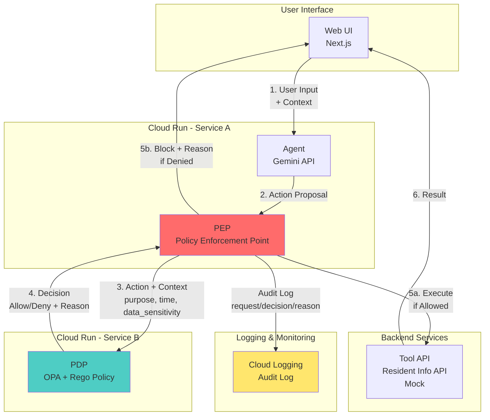
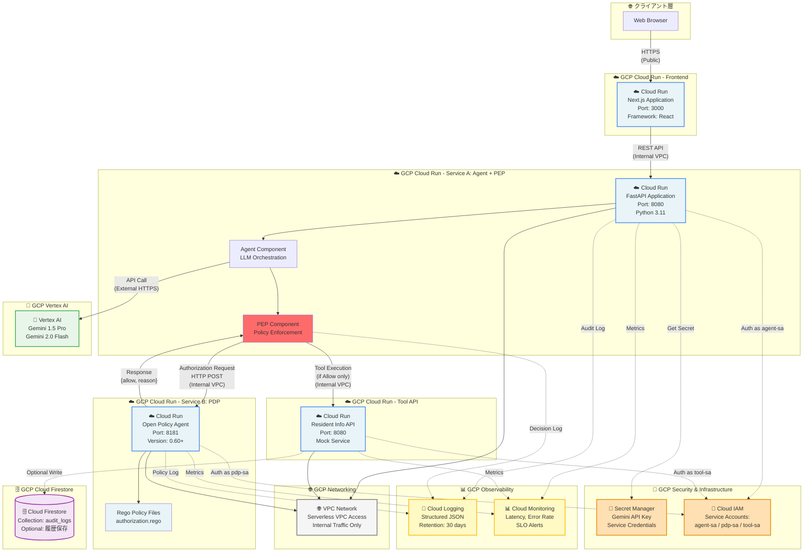
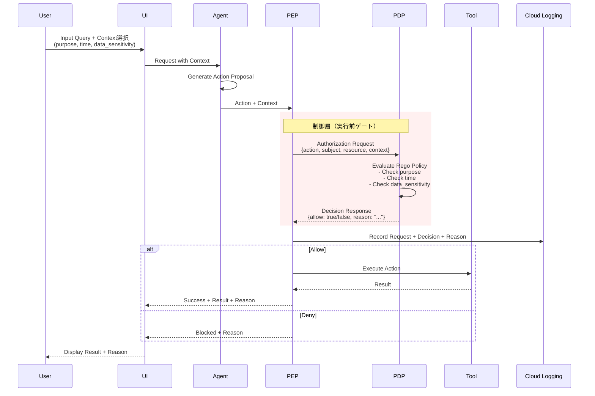
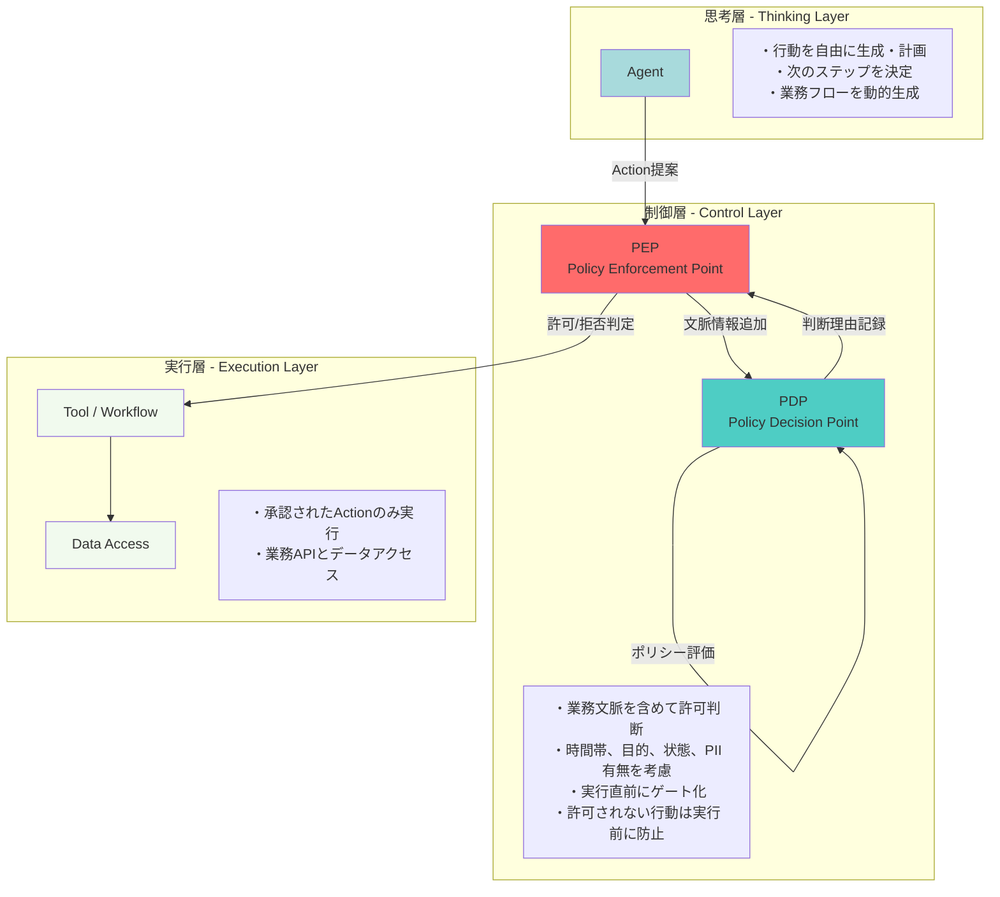

# Architecture
## 結論：推奨アーキテクチャ（PoC向け）
（Authなし / Envoyなし / OPAあり）

**最小で刺さる構成：Cloud Run 2サービス**

- **Service A**：Agent + PEP（ゲート）API（Cloud Run）
- **Service B**：PDP（Policy Engine / OPA）（Cloud Run）

この構成で、AGA PoCとして「本当に見せたい核心」を最短で証明できる。

### Google Cloud 要件への適合

- 実行基盤：Cloud Run  
- AI 利用：Gemini API（Vertex AI 経由推奨）  
- Agentic AI Hackathon の条件を自然に満たす  

---

## AGA PoCで「証明したい3点」との対応

### 証明対象①  
**Action は同じでも、Context によって Allow / Deny が変わる**

- Agent が生成する Action は常に同一
- 認証・権限も同一
- Context だけを変えると、実行可否が変わる

→ 「権限」ではなく「文脈」で制御していることを明確に示す

---

### 証明対象②  
**PEP が “実行前に” 必ず止める（強制力）**

- Tool 実行の直前に必ず PDP に照会
- Deny の場合は **実行前にブロック**
- 「ログを残す」ではなく「実行させない」構造を見せる

---

### 証明対象③  
**判断理由（Explainability）がログとして残る**

- PDP は Allow / Deny だけでなく **理由（reason）** を返す
- UI にそのまま表示
- Cloud Logging に request / decision / reason を記録

→ 審査員が一瞬で「価値」を理解できる

---

## コンポーネント分割（PoCの責務境界）

### Service A：Agent + PEP（Cloud Run）

**責務**

- ユーザー入力から `Action案 + Context` を受け取る
- 実行直前に **必ず PDP に照会**（PEP）
- Allow のときだけ Tool を実行
- Deny のときは理由を UI に返す
- 監査ログ（request / decision / reason）を残す

**PoC上の割り切り**

- Agent は LLM で「それっぽく Action を出すだけ」で OK
- 本命は **PEP が実行前に必ず止める構造**

---

### Service B：PDP（OPA on Cloud Run）

**責務**

- input として以下を受け取る  
  - action  
  - subject（今回はダミーで可）  
  - resource  
  - context（purpose / time / data_sensitivity など）
- Rego ポリシーで Allow / Deny を判断
- **Allow / Deny の理由（文字列）を返す**

※「理由」を返すことがデモで非常に強いポイント

---

### Tool（業務 API：Resident Info API）

- PoC では **モックで OK**
- `get_resident_info` を呼ぶとダミー住民情報を返す
- 重要なのは  
  **「叩ける／叩けない」が PEP で制御されること**

---

## データ / ログ（PoC最低限）

- **Cloud Logging**：必須  
  - 監査ログ・説明責任デモに直結
- Firestore（任意）  
  - 履歴 UI を作りたい場合のみ
  - PoC は Cloud Logging だけでも成立

---

## 技術選定（推奨）

### 1. 実行基盤
- **Cloud Run（確定）**
  - デプロイが速い
  - 2サービス構成が簡単
  - ハッカソン向き

### 2. AI（Agent 部分）
- **Gemini API（Vertex AI 経由推奨）**
  - ルール要件を満たす
  - 「Agentic AI Hackathon」との整合が強い

※ PoC では LLM の賢さは勝ち筋ではない  
※ 主役は **Action → Gate → Decision → Reason**

---

### 3. Policy Engine（PDP）
- **OPA（Open Policy Agent）+ Rego**
  - PoC が作りやすい
  - 「Policy as Code」が審査員に刺さる
  - 設計次第で理由返却も可能

---

### 4. PEP（ゲート）の実装
- **アプリ内 PEP（最速・最小）**

Agent / Tool 呼び出し直前に  
必ず PDP に照会する構造を実装する。

※ Envoy を入れると「それっぽさ」は上がるが  
1ヶ月 PoC では工数・事故率が上がる  
→ **まずはアプリ内 PEP で勝つ**

---

## Envoy / Auth0 は必要か？

### Envoy
- PoC では **不要（Nice-to-have）**
- 次の段階で価値が出る
  - マイクロサービス横断 PEP
  - Sidecar による強制ゲート

---

### Auth0
- PoC では **必須ではない**
- 入れる価値があるのは以下の場合のみ
  - 「現実の IAM と繋がる」印象を与えたい
  - subject（代理元）を JWT クレームで綺麗に出したい

※ 入れすぎると「認証デモ」に見える  
※ **AGA の主役を食わせないことが重要**

---

## Context 受け渡しの難所への対応（PoC向け割り切り）

一番燃えやすいポイント。

**PoCでは以下に割り切る：**

- Context は UI で明示入力 or 選択式
  - purpose
  - time
  - data_sensitivity
- Agent は Context を生成しない
- LLM の妥当性議論を避ける

**PoCの狙い**

- Context が正しいかどうか → 問わない  
- Context が変わると実行可否が変わる  
  **「構造」そのものを証明する**

---

## 推奨アーキテクチャ（文章版）

UI（Web）  
→ Agent + PEP API（Cloud Run）  
→ PDP（OPA on Cloud Run）で Allow / Deny + Reason  
→ Allow の場合のみ Tool API 実行（モック）  
→ request / decision / reason を Cloud Logging に記録  
→ UI に reason を表示（デモの主役）

---

## 技術スタックまとめ（PoC推奨セット）

- フロント：Next.js（最小構成、Context 選択が肝）
- Agent + PEP：Cloud Run（任意言語）
- PDP：OPA（Cloud Run）
- AI：Gemini API（Vertex AI）
- ログ：Cloud Logging（必須）
- データ（任意）：Firestore

---

## アーキテクチャ図

### 1. システムアーキテクチャ図（PoC構成）

**説明:**
- Service A（Agent + PEP）が実行直前に必ずService B（PDP）に照会
- PDPはContextを含めて判断し、理由とともに結果を返す
- PEPはAllowの場合のみToolを実行、Denyの場合は実行前にブロック
- 全ての判断はCloud Loggingに記録される

---

### 1-2. GCPサービス詳細アーキテクチャ図

**GCPサービス詳細一覧:**

| コンポーネント | GCPサービス | 詳細仕様 | 役割 |
|--------------|------------|---------|------|
| **Frontend** | Cloud Run | Next.js (React), Port 3000 | ユーザーインターフェース、Context選択UI |
| **Service A** | Cloud Run | FastAPI (Python 3.11), Port 8080 | Agent + PEP統合、リクエストオーケストレーション |
| **AI Engine** | Vertex AI | Gemini 1.5 Pro / 2.0 Flash | Action生成、自然言語理解 |
| **Service B (PDP)** | Cloud Run | OPA 0.60+, Port 8181 | ポリシーベース認可判断 |
| **Policy Store** | Container内 | Rego Policy Files | 認可ルールをコードで管理 |
| **Tool API** | Cloud Run | Mock API, Port 8080 | 住民情報取得（業務API） |
| **履歴DB** | Cloud Firestore | Collection: audit_logs | リクエスト履歴（オプション） |
| **監査ログ** | Cloud Logging | Structured JSON, 30日保持 | 全リクエスト・決定・理由を記録 |
| **監視** | Cloud Monitoring | Latency, Error Rate metrics | SLO監視、アラート設定 |
| **ネットワーク** | VPC Network | Serverless VPC Access | Cloud Run間のプライベート通信 |
| **シークレット** | Secret Manager | Encrypted at rest | Gemini APIキー、認証情報 |
| **認証認可** | Cloud IAM | Service Accounts (3個) | 最小権限の原則、サービス間認証 |

**通信パターン詳細:**

| 通信経路 | プロトコル | 公開/内部 | 認証方式 |
|---------|-----------|---------|---------|
| Browser → Frontend | HTTPS | Public | なし（将来的にAuth0） |
| Frontend → Service A | HTTPS | Internal (VPC) | Service Account |
| Service A → Vertex AI | HTTPS | External (Google API) | API Key (Secret Manager) |
| Service A → Service B | HTTP | Internal (VPC) | Service Account |
| Service A → Tool API | HTTP | Internal (VPC) | Service Account |
| Services → Cloud Logging | gRPC | Internal | Automatic (Cloud SDK) |
| Services → Secret Manager | HTTPS | Internal | IAM Policy |

**デプロイ設定:**
- **Cloud Run**: すべてコンテナ化、自動スケーリング（min: 0, max: 10）
- **VPC**: Serverless VPC Accessコネクタ使用
- **Service Account**: 各サービスに専用のSAを割り当て
- **リージョン**: asia-northeast1 (東京) 推奨

---

### 2. データフロー詳細図

**説明:**
- 同じActionでも、Contextが異なればAllow/Denyが変わる
- PEPが実行直前に必ず止める構造（強制力）
- PDPは判断理由（Explainability）をログとして残す

---

### 3. 3層アーキテクチャ概念図

**説明:**

| 観点 | 従来型 | AGA |
|------|------|-----|
| 認可配置 | API境界内 | 業務フロー外（制御層） |
| 判断材料 | 「誰が何を呼んだか」 | 「目的・時間帯・状態を含む文脈」 |
| 説明責任 | 事後的で属人的 | ポリシー+ログで構造的に説明可能 |

この3層分離により、AI Agent導入時の「誰が、どこで、何に責任を持つのか」が明確化される。

---

