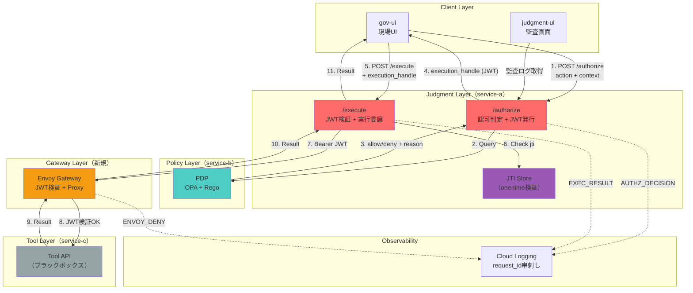
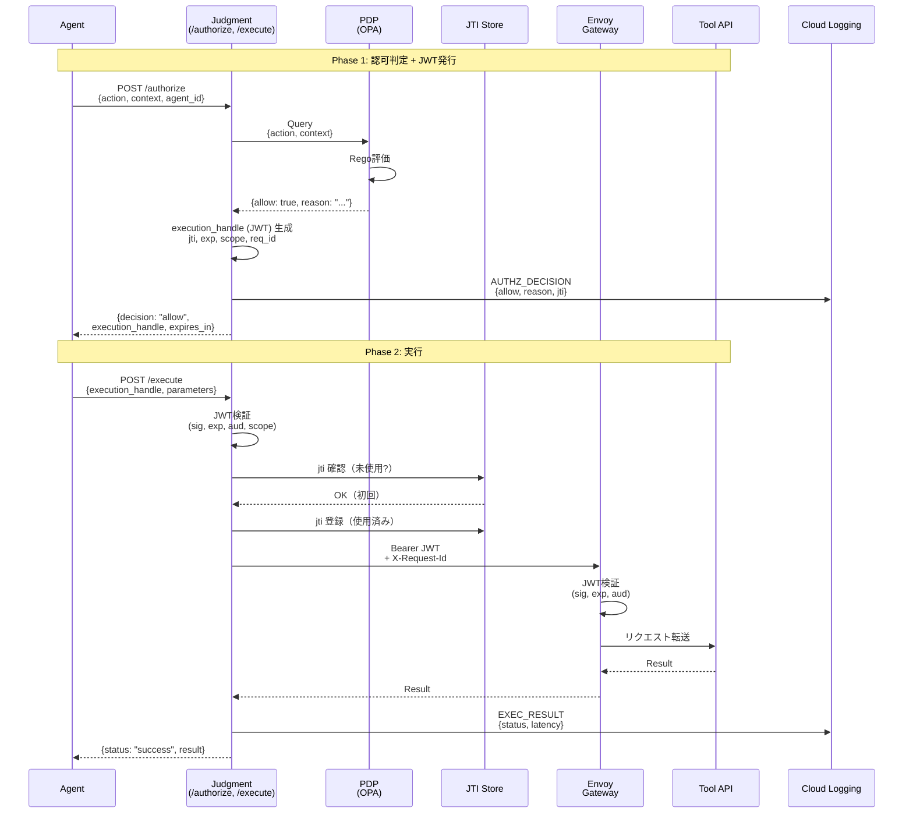
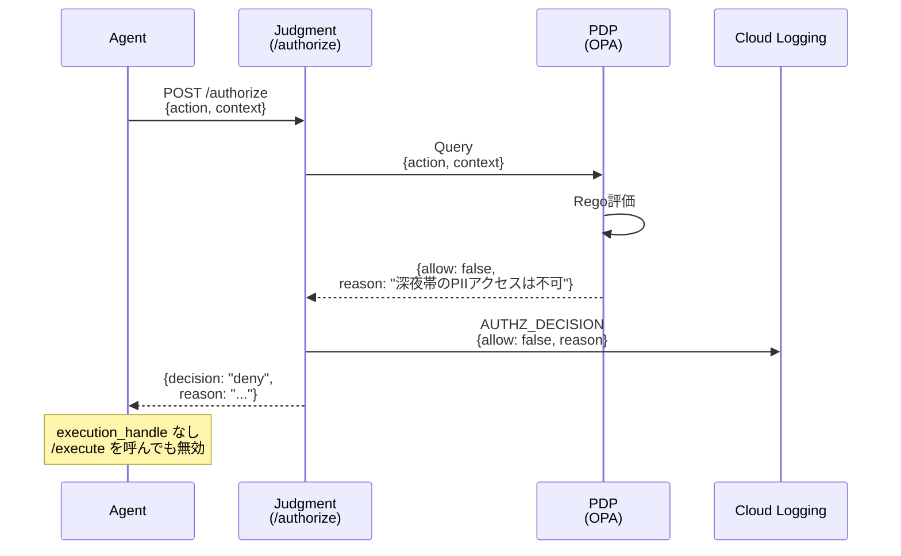
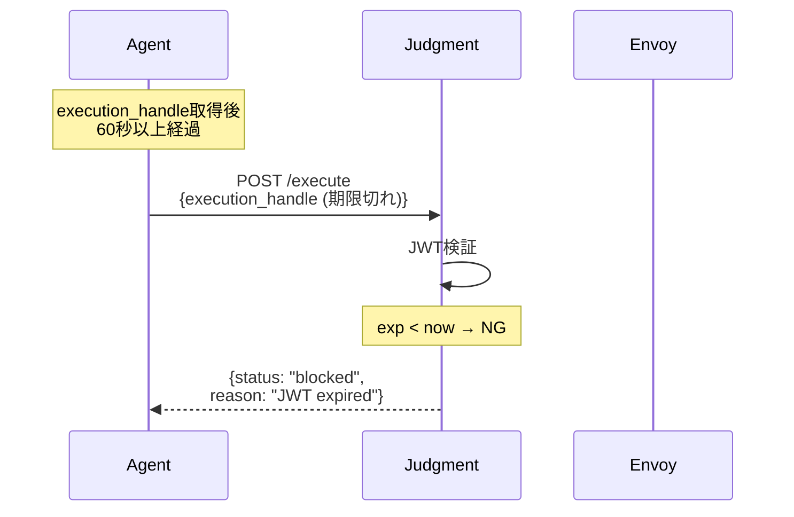
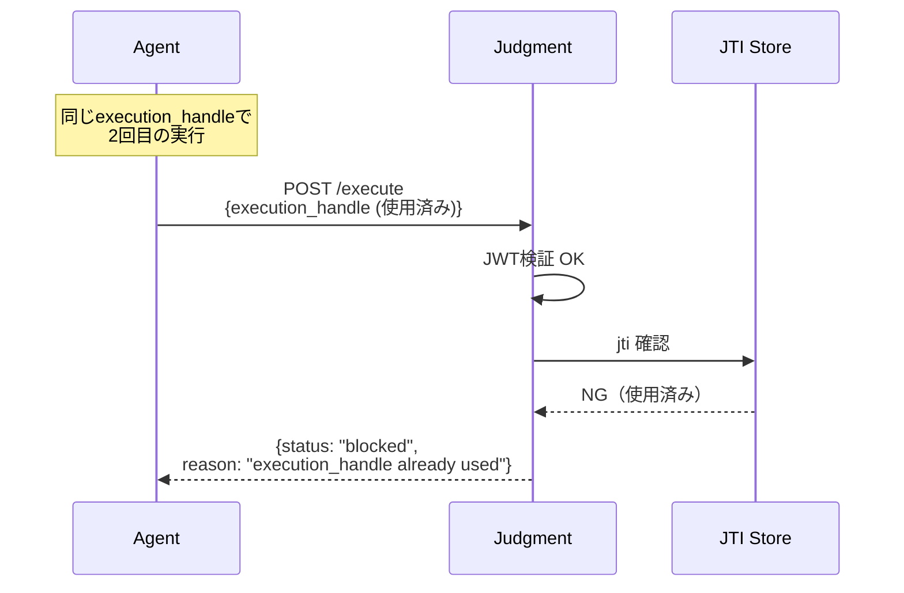
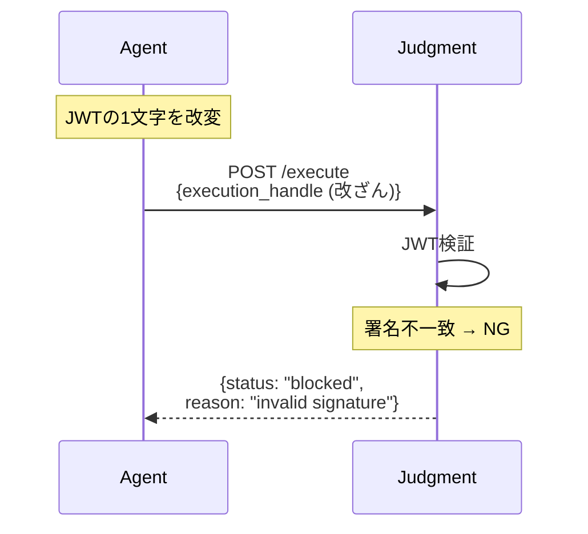

# Judgment 拡張計画：2段認可 + 構造的強制力の実装

## 概要

本計画は、**既存のJudgment最小PoC（5サービス構成）を前提**に、以下の拡張を行うための実装計画である。

- `/authorize` → `/execute` の**2段構成**
- **execution_handle（JWT）** による実行チケット発行・検証
- **Envoy Gateway** による構造的な強制力
- **one-time実行**（二重実行防止）

### 背景：AGAとJudgment

| 用語 | 説明 |
|------|------|
| **AGA（Action-Gated Authorization）** | AI Agentの行動を「実行前に」「業務文脈を含めて」制御するという**設計思想** |
| **Judgment** | AGA思想を実現する**プロダクト**。認可判定エンジンとしてPEP/PDPの役割を担う |

### 現在のPoC構成（実装済み）

| サービス | 役割 | 技術 |
|---------|------|------|
| service-a | Agent + Judgment（PEP） | FastAPI |
| service-b | PDP（OPA） | OPA + Rego |
| service-c | Tool mock | FastAPI |
| judgment-ui | Judgment監査画面 | Next.js |
| gov-ui | デモ用現場UI | Next.js |

### 拡張後のゴール

**「/authorize → /execute を通らないとToolに到達できない」** ことを、アプリ内の`if`文ではなく**構造（Envoy + 経路固定）** で示す。

---

## アーキテクチャ図

### 拡張後のシステム構成



### 責務境界の明確化

| レイヤー | 責務 | JWT操作 |
|---------|------|---------|
| **Judgment /authorize** | 認可判定、JWT発行 | 発行（sign） |
| **Judgment /execute** | JWT検証、one-time検証、実行委譲 | 検証（verify） |
| **Envoy Gateway** | JWT検証、Proxy | 検証（verify） |
| **Tool API** | 業務処理（ブラックボックス） | なし |

### 経路の強制

```
[許可された経路]
Agent → Judgment(/authorize) → PDP → JWT発行
Agent → Judgment(/execute) → Envoy → Tool

[禁止された経路（構造的に不可能）]
Agent → Tool（直接）     ← Envoyが止める（JWTなし）
Agent → Envoy → Tool     ← Envoyが止める（JWTなし or 無効）
```

---

## シーケンス図

### Allowフロー（正常系）



### Denyフロー（ポリシー拒否）



### 構造的強制力のデモシナリオ

#### シナリオA：期限切れJWT



#### シナリオB：二重実行（one-time違反）



#### シナリオC：JWT改ざん



---

## 1. 完成条件（Definition of Done）

### 機能DoD

- [ ] Agent は `POST /authorize` → `POST /execute` の2段でしか実行できない
- [ ] `/authorize` は **allow/deny + reason** を返し、allowのときのみ **execution_handle（JWT）** を発行
- [ ] `/execute` は execution_handle を検証（署名/exp/jti/scope/one-time）し、OKのときのみ実行
- [ ] Tool呼び出しは **必ず Envoy 経由**（Judgment → Tool 直叩き経路が存在しない）
- [ ] Envoy でも JWT を検証し、NG なら Tool へ到達しない
- [ ] `request_id` で authorize → execute → proxy → tool が **Cloud Logging で串刺し**できる
- [ ] 2ケースデモ（Allow / Deny）がUIまたはcurlで再現できる

### デモDoD（審査員に刺さる見せ方）

- [ ] 「/authorizeで"理由付き"で止める」→「/executeを叩いても通らない」までを数十秒で見せられる
- [ ] 「JWTを改ざん/期限切れ/二重実行」など、**構造的強制力の証明**が1つ以上入っている
- [ ] 記事に載せる図（PDP/Judgment/Envoyの責務境界）とシーケンスが揃っている

---

## 2. 進め方

### Phase 0：基盤方針の確定

**成果物**

- [ ] execution_handle（JWT）のクレーム定義（確定版）
- [ ] OPA input schema（authorizeで渡すinput）確定
- [ ] Envoyの責務（何を検証し、何をしないか）確定

**決め切る事項**

| 項目 | 方針 |
|------|------|
| execution_handle | 「外部APIの認証トークン」ではなく **Judgment内輪の実行チケット** |
| Tool（外部API） | ブラックボックス（JWT検証しない） |
| 検証 | **Judgment と Envoy の二重**（デモで"構造の強制力"を示すため） |

---

## 3. 実装計画

### 3.1 Judgment：/authorize（発行）側の拡張

**目的**

PDP（OPA）から allow/deny + reason を得て、allowなら **execution_handle（JWT）を発行**する。

**タスク**

- [ ] `/authorize` の入出力を確定（7章「インターフェース」参照）
- [ ] OPAへ投げる `input` を **固定スキーマ**にする
  - 例：`{action, agent_id, context, request_id, now, ...}`
- [ ] OPAレスポンス（allow/deny/reason）を Judgment 側で正規化
- [ ] allow時に execution_handle を生成（署名付きJWT）
  - [ ] `iss/aud/sub/jti/exp/scope/req_id` は必須
  - [ ] `ctx_hash` を入れるならここで生成（PoCではoptional）
- [ ] Cloud Logging に `AUTHZ_DECISION` を出す（req_id, allow, reason, scope, jti, exp）
- [ ] レスポンスに `execution_handle` を返す（allow時のみ）

---

### 3.2 Judgment：/execute（検証＋実行）側の拡張

**目的**

Agentが提示した execution_handle を検証し、OKなら Envoy 経由でToolを実行する。
**one-time**（二重実行防止）を入れて「使い捨てチケット」感を出す。

**検証タスク**

- [ ] `/execute` の入出力を確定（7章「インターフェース」参照）
- [ ] JWT検証（Judgment内）
  - [ ] 署名検証（公開鍵/秘密鍵運用は最小で）
  - [ ] `exp`（短命）
  - [ ] `aud`（envoy-gateway など）
  - [ ] `scope`（executeするactionに一致）
  - [ ] `req_id`（監査の串刺し）
- [ ] one-time実行（最低限の仕組み）
  - [ ] `jti` をストア（Firestore/Redis相当/メモリでもPoC可）
  - [ ] **初回のみOK**、2回目以降は拒否
  - [ ] デモで効く「使い捨てチケット」

**実行タスク**

- [ ] Judgment → Envoy への転送を実装（HTTP）
  - [ ] `Authorization: Bearer <execution_handle>`
  - [ ] 実行対象（tool endpoint/path）をJudgment側で決める（Agentに直接URLを渡さない）
- [ ] 結果を Agent に返却
- [ ] Cloud Logging に `EXECUTION_RESULT`（req_id, jti, status, latency, tool）を出す

---

### 3.3 PDP（OPA）：ポリシー拡張

**目的**

allow/deny + reason を返し、説明可能性を担保する。

**タスク**

- [ ] input schema を Rego 側でも固定（ドキュメント化）
- [ ] ルールを3〜5個に絞る（PoCの芯だけ）
  - [ ] business_hours 以外は deny（purpose=inquiry の場合）
  - [ ] data_sensitivity が high の場合は deny（inquiry目的）
  - [ ] actionごとに必要最小限のcontextを満たさないと deny
- [ ] 返却形式を決める（例）
  ```json
  {"allow": true/false, "reason": "...", "policy_id": "...", "tags": [...]}
  ```
- [ ] Cloud Logging（OPA側）にも req_id を出す（できれば）

---

### 3.4 Envoy Gateway：JWT検証 + Proxy

**目的**

Toolへの入口を Envoy に固定し、**JWTがないと到達不能**にする。
「アプリのif文ではなく構造で止める」を成立させる。

**環境タスク**

- [ ] Envoy を Cloud Run で起動
- [ ] Envoy の upstream を Tool API（モック）へ向ける
- [ ] ルーティング：`/tool/*` を tool にプロキシ

**JWT検証タスク**

- [ ] Envoy で JWT検証を有効化（署名/exp/aud）
- [ ] `aud` を `envoy-gateway` に固定（Judgmentで発行するaudと合わせる）
- [ ] `scope` を見て許可するパスを絞る（可能なら）
  - 例：`scope` に `execute:get_resident_info` がないと `/tool/resident-info` に到達不可

**ログタスク**

- [ ] Envoy access log に `req_id` 相当を出す（headerで渡す or JWT claim）
- [ ] Cloud Logging で「Envoyで止めた」が見えるようにする

---

### 3.5 Tool API（モック）：最小実装

**目的**

「叩ける/叩けない」を見せるだけ。ビジネスロジックは不要。

**タスク**

- [ ] `GET/POST /tool/resident-info` を実装（ダミー応答でOK）
- [ ] Envoyのみから到達できるようにする（できる範囲で）
- [ ] Tool側で `Authorization` は検証しない（ブラックボックス前提）

---

## 4. デモ設計

### デモシナリオ（最小2本）

#### 1. Allowフロー

```
Context A: purpose=inquiry, time=business_hours, data_sensitivity=required
```

1. `/authorize` → allow + reason + execution_handle
2. `/execute` → Envoy経由で tool 成功
3. ログで reason / req_id 串刺し

#### 2. Denyフロー

```
Context B: purpose=inquiry, time=night, data_sensitivity=high
```

1. `/authorize` → deny + reason
2. execution_handle なし
3. `/execute` しても通らない（400/401等）

### 構造的強制力を示す追加ワンショット

以下のいずれか1つで十分：

- [ ] **期限切れ**：exp短命にして、少し待ってから /execute → Envoyで401
- [ ] **改ざん**：JWTの1文字変えて /execute → Judgment or EnvoyでNG
- [ ] **二重実行**：同じexecution_handleで2回 /execute → 2回目deny（one-time）

---

## 5. デプロイ計画

### サービス一覧（拡張後）

| サービス | 役割 | 備考 |
|---------|------|------|
| Judgment（service-a） | Agent + PEP + /authorize + /execute | 拡張 |
| PDP（service-b） | OPA | 既存 |
| Envoy（新規） | JWT検証 + Proxy | 新規追加 |
| Tool API（service-c） | モック | 既存 |
| judgment-ui | Judgment監査画面 | 既存 |
| gov-ui | デモ用現場UI | 既存 |

### ルーティング（固定する）

- Agent → Judgment のみ到達可能
- Judgment → Envoy → Tool の経路を固定
- **Judgment が Tool を直叩きできないようにする**（構造で強制）

---

## 6. 監査ログ設計

**共通キー：request_id**

| イベント | 内容 |
|---------|------|
| `AUTHZ_REQUEST` | action, context, agent_id, request_id |
| `AUTHZ_DECISION` | allow, reason, policy_id, request_id, jti, exp, scope |
| `EXEC_REQUEST` | request_id, jti, scope |
| `EXEC_RESULT` | request_id, status, latency, tool |
| `ENVOY_DENY` | request_id, reason（exp/invalid_aud/invalid_sig 等） |

---

## 7. インターフェース定義

### 7.1 POST /authorize（Judgment）

**Request**

```json
{
  "agent_id": "agent-1",
  "action": "get_resident_info",
  "context": {
    "purpose": "inquiry",
    "time": "business_hours",
    "data_sensitivity": "required"
  },
  "request_id": "uuid-..."
}
```

**Response（allow）**

```json
{
  "request_id": "uuid-...",
  "decision": "allow",
  "reason": "問い合わせ対応のため、営業時間内で必要最小限のPIIアクセス",
  "execution_handle": "<signed-jwt>",
  "expires_in_seconds": 60
}
```

**Response（deny）**

```json
{
  "request_id": "uuid-...",
  "decision": "deny",
  "reason": "問い合わせ目的では深夜の高感度PIIアクセスは正当化できない"
}
```

### 7.2 POST /execute（Judgment）

**Request**

```json
{
  "request_id": "uuid-...",
  "execution_handle": "<signed-jwt>",
  "parameters": {
    "resident_id": "R-0001"
  }
}
```

**Response（success）**

```json
{
  "request_id": "uuid-...",
  "status": "success",
  "result": {
    "resident_id": "R-0001",
    "name": "Taro Yamada",
    "address": "Tokyo",
    "note": "dummy"
  }
}
```

**Response（fail: invalid/expired/used）**

```json
{
  "request_id": "uuid-...",
  "status": "blocked",
  "reason": "execution_handle is expired or invalid"
}
```

---

## 8. execution_handle（JWT）仕様

### Header

```
alg: RS256（推奨）or HS256（PoCで簡略化可）
kid: 鍵ローテ用（余裕があれば）
```

### Claims（必須）

| Claim | 説明 |
|-------|------|
| `iss` | "judgment" |
| `aud` | "envoy-gateway" |
| `sub` | "agent-1" |
| `jti` | "uuid" |
| `exp` | UNIX time（短命：30s〜120s） |
| `iat` | UNIX time |
| `scope` | "execute:get_resident_info" |
| `req_id` | "uuid-..." |

### Claims（任意）

| Claim | 説明 |
|-------|------|
| `ctx_hash` | contextのハッシュ（Context改ざん論点を潰すなら） |

---

## 9. スプリント例（実作業の順番）

### Day 1：/authorize 完成

- OPA query → allow/deny + reason → logging
- execution_handle 発行

### Day 2：/execute 検証完成

- JWT verify（Judgment内）
- one-time（jtiストア）導入

### Day 3：Envoy Gateway 立ち上げ

- proxy経路を作る（Judgment → Envoy → Tool）
- EnvoyでJWT verify

### Day 4：デモ固め

- Allow/Denyの2ケース
- 期限切れ or 二重実行の「構造的強制力デモ」を追加

### Day 5：監査ログ整形 & 図/記事素材

- req_id串刺しが一目で分かるログ
- アーキ図・シーケンス図を揃える

---

## 10. スコープ外（やらないこと）

- ReBAC/FGA連携
- Tool側でのJWT検証（ブラックボックス前提）
- 高度な鍵管理/ローテ（PoCは最小）
- Agentの賢さ追求（PoCの勝ち筋は「構造」）
