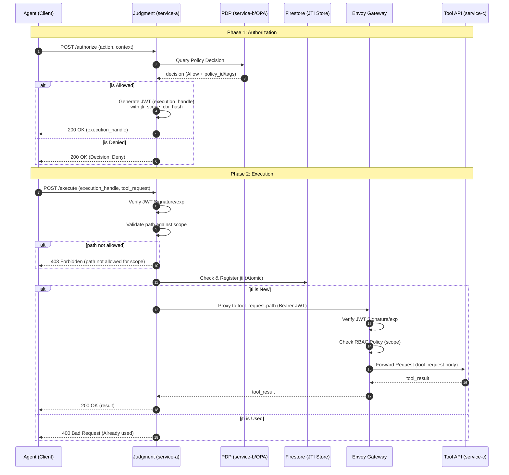

# シーケンス図

2段認可と構造的強制力を伴う Tool 実行の全体フローを定義します。

## 各ステップの補足
1. **認可リクエスト**: Agent は自身の ID、実行したいアクション、利用目的（context）を Judgment に提示します。
2. **ポリシー判定**: OPA は渡されたアクションとコンテキストを事前に定義された Rego ポリシーに照らして判定します。
3. **JWT生成**: `ctx_hash` を含めることで、後の実行時にコンテキストそのものが改ざん（すり替え）されることを防ぎます。
4. **JTIチェック**: Firestore の `jti_store` に登録を試みることで、複数のコンテナ間で同時に同じ JWT が使われたとしても、アトミックに一つに絞り込むことができます。
5. **Envoy RBAC**: `/tool/resident-info` などのセンシティブなパスへの到達は、Envoy が JWT の `scope` クレームを見て物理的に遮断/許可します。
