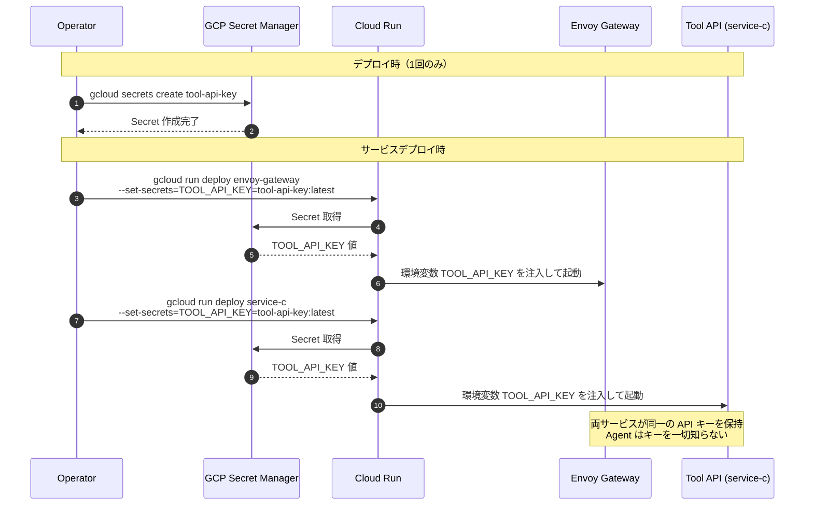
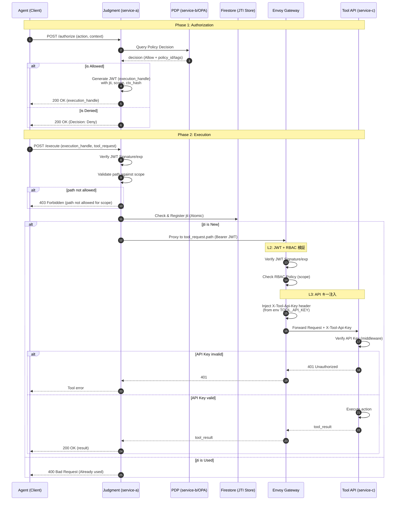
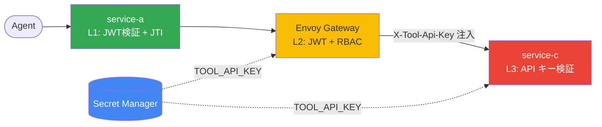

# シーケンス図

## デプロイ時: API キーのプロビジョニング

GCP Secret Manager から API キーが各サービスに注入される流れを示します。

---

## ランタイム: 2段認可と Tool 実行

2段認可と構造的強制力を伴う Tool 実行の全体フローを定義します。

---

## 防御レイヤー構成

| レイヤー | 場所 | 検証内容 | 失敗時 |
|---------|------|----------|--------|
| L1 | service-a `/execute` | JWT 署名・有効期限・JTI・scope/path | blocked |
| L2 | Envoy Gateway | JWT 署名・有効期限・RBAC (scope) | 401/403 |
| L3 | service-c | API キー (`X-Tool-Api-Key`) | 401 |

---

## 各ステップの補足
1. **認可リクエスト**: Agent は自身の ID、実行したいアクション、利用目的（context）を Judgment に提示します。
2. **ポリシー判定**: OPA は渡されたアクションとコンテキストを事前に定義された Rego ポリシーに照らして判定します。
3. **JWT生成**: `ctx_hash` を含めることで、後の実行時にコンテキストそのものが改ざん（すり替え）されることを防ぎます。
4. **JTIチェック**: Firestore の `jti_store` に登録を試みることで、複数のコンテナ間で同時に同じ JWT が使われたとしても、アトミックに一つに絞り込むことができます。
5. **Envoy RBAC**: `/tool/resident-info` などのセンシティブなパスへの到達は、Envoy が JWT の `scope` クレームを見て物理的に遮断/許可します。
6. **API キー注入**: Envoy が `request_headers_to_add` で `X-Tool-Api-Key` を付与します。Agent はこのキーを一切知りません。キーは GCP Secret Manager（ローカルでは環境変数）から取得されます。
7. **API キー検証**: service-c のミドルウェアが全リクエスト（`/health` 除く）で `X-Tool-Api-Key` ヘッダを検証します。直接アクセスはすべて 401 で遮断されます。
