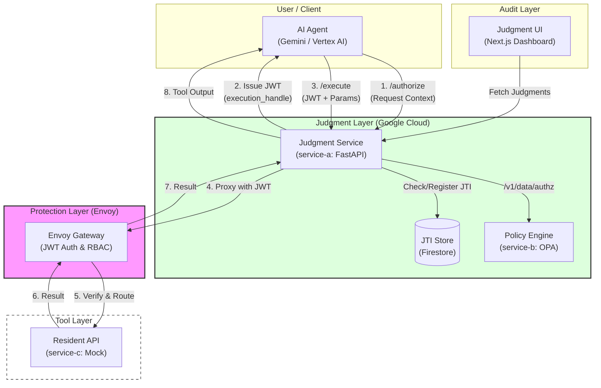

# アーキテクチャ構成図

本プロジェクトの全体構成とコンポーネント間の関係を示します。

## コンポーネントの役割

### 1. Judgment Service (PEP: Policy Enforcement Point)
AI Agent からのリクエストを受け付け、認可判定（Phase 1）と実行仲介（Phase 2）を行う中心的なコンポーネントです。実行時には認可チケットの有効性（二重実行防止含む）を検証します。

### 2. Policy Engine (PDP: Policy Decision Point)
OPA (Open Policy Agent) を採用しています。`service-a` から渡されたアクション、コンテキストを Rego 言語で記述されたポリシーに基づき判定します。

### 3. JTI Store (Firestore)
発行された認可チケット（JWT）の一意識別子（jti）を保存し、アトミックな書き込みによってチケットの使い回しを物理的に不可能にします。

> ローカル環境では `firestore-emulator` (Docker) でエミュレートされます。

### 4. Envoy Gateway
構造的強制力を担うプロキシ層です。Judgment サービスを介さない直接的なツール実行を防ぐとともに、JWT の `scope` クレームに基づいた L7（パスレベル）の認可制御をインフラ層で提供します。

### 5. Tool Layer
実際の業務機能を提供する API 群です。今回の PoC では住民情報の取得を行う `service-c` がこれに該当します。

### 6. Judgment UI (Audit Dashboard)
認可判定の結果（Judgments）を一覧表示するための監査用画面です。`service-a` が提供する監査用 API を叩いてデータを取得します。
