# 認可の配置シフト

従来の「境界の一段階チェック」から「ビジネスフロー内の動的ゲート」へ移行する

---

# AI Agent時代の認可アーキテクチャ

*業務フローから「認可」を分離すべき理由*

---

# 従来の世界：人間中心の実行経路

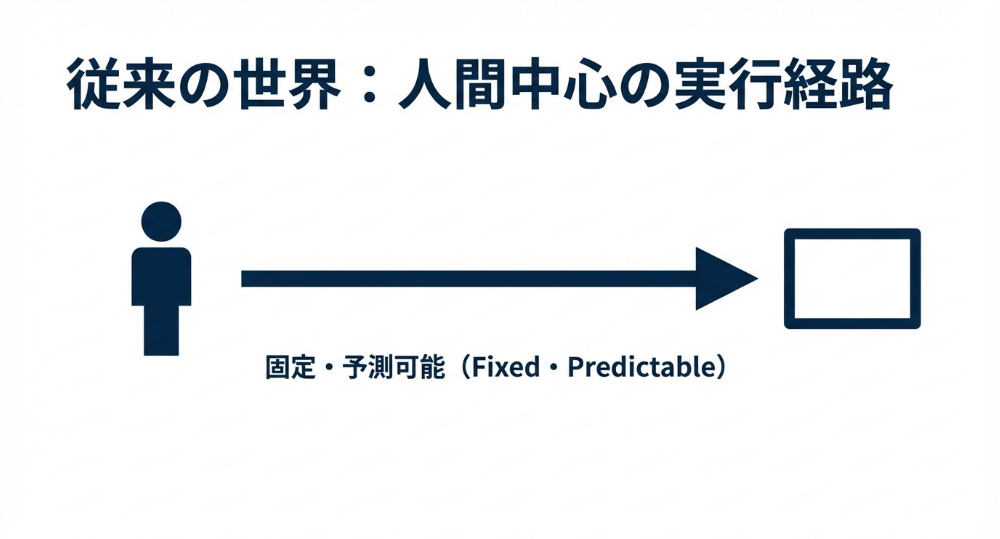
*人間による操作は固定・予測可能（Fixed・Predictable）*

---

# AI Agentの登場：実行経路の非決定性

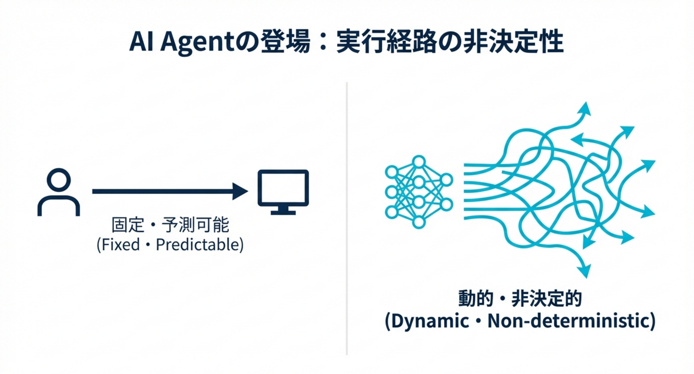
*AI Agentによる実行経路は動的・非決定的（Dynamic・Non-deterministic）*

---

# 境界型認可の限界

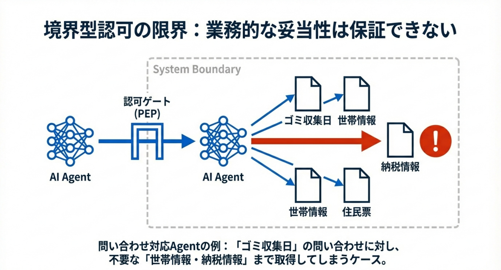
*例：「ゴミ収集日」の問い合わせに対し、不要な「世帯情報・納税情報」まで取得してしまうケース*

---

# 説明責任の構造的崩壊

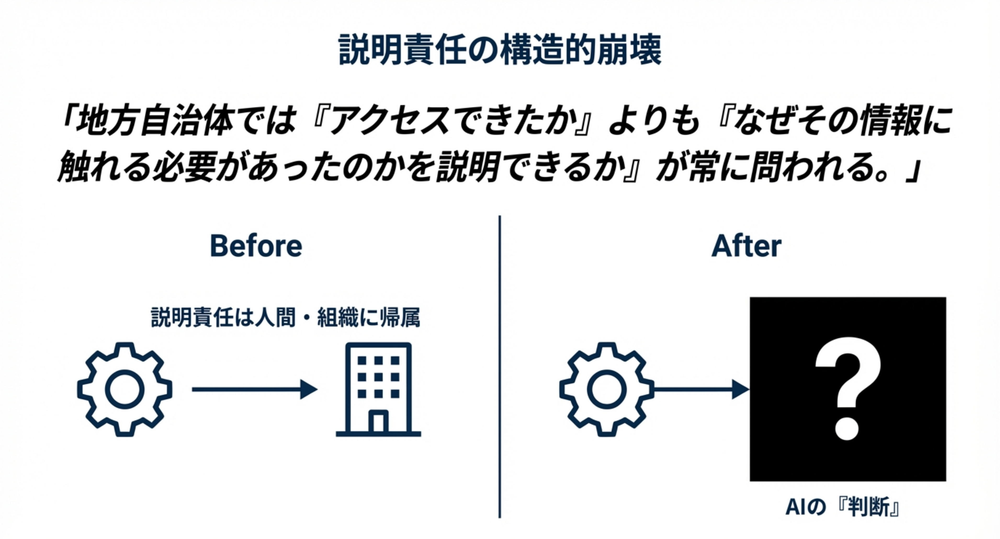
*地方自治体では『アクセスできたか』よりも『なぜその情報に触れる必要があったのかを説明できるか』が常に問われる*

---

# AIへの責任転嫁は通用しない

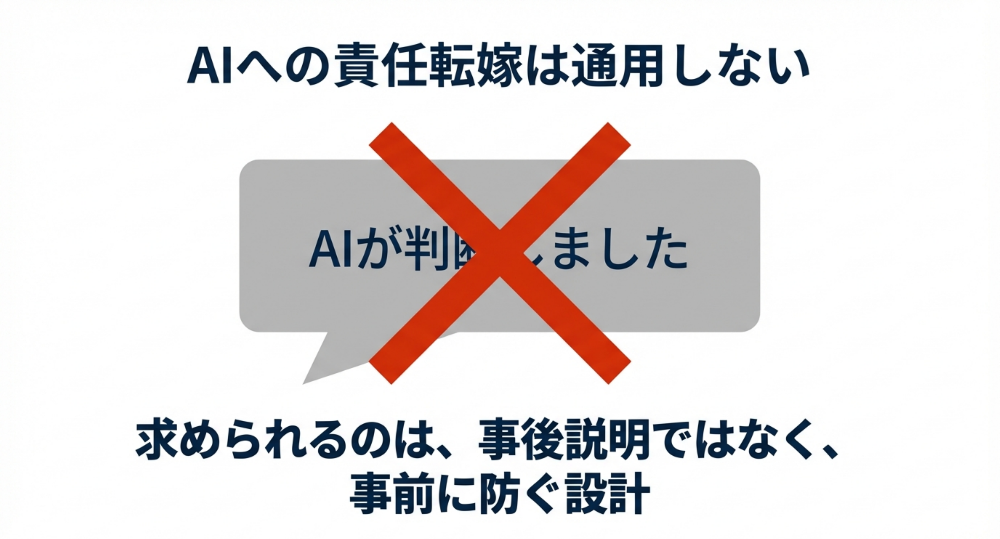
*求められるのは、事後説明ではなく、事前に防ぐ設計*

---

# 問題はモデルではなく「配置」にある

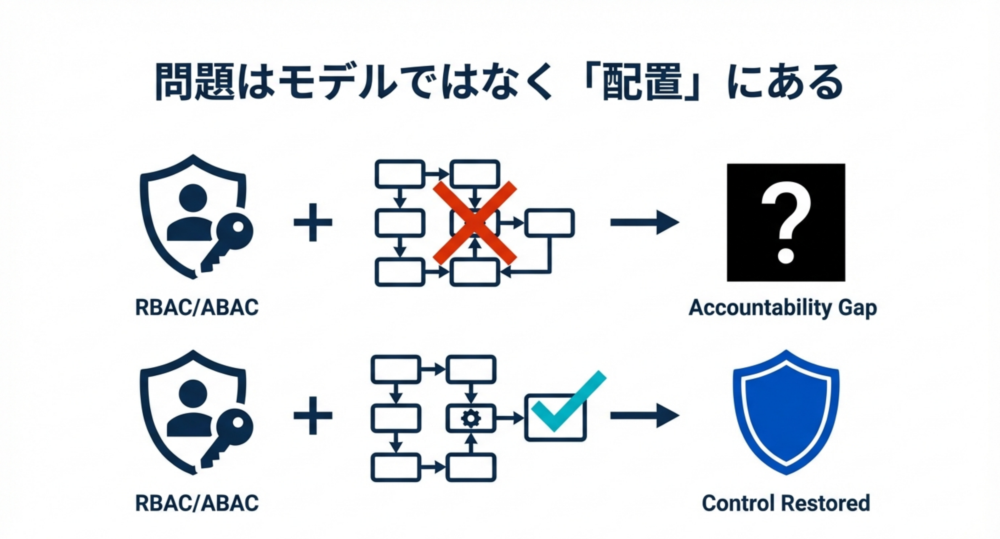
*RBAC/ABACの配置が適切でないとAccountability Gap、適切ならControl Restored*

---

# 基本構造：判断(PDP)と実行(PEP)の分離

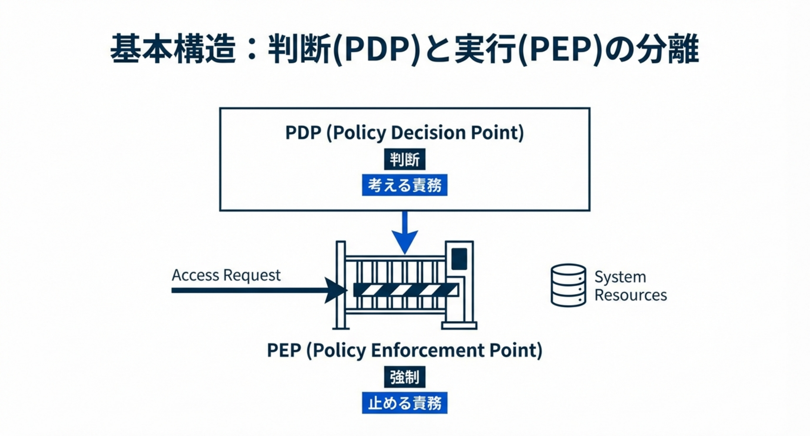
*PDP: 判断（考える責務）、PEP: 強制（止める責務）*

---

# 提案：Action-Gated Authorization (AGA)

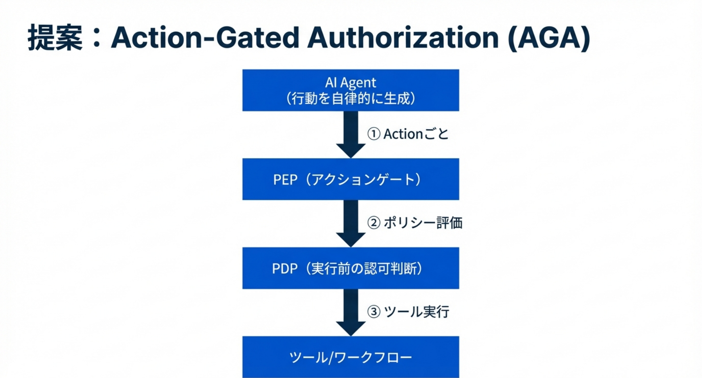
*AI Agentの各Actionに対して、PEP → PDP → ツール実行の流れを強制*

---

# 思考と実行の分離：3つの配置パターン

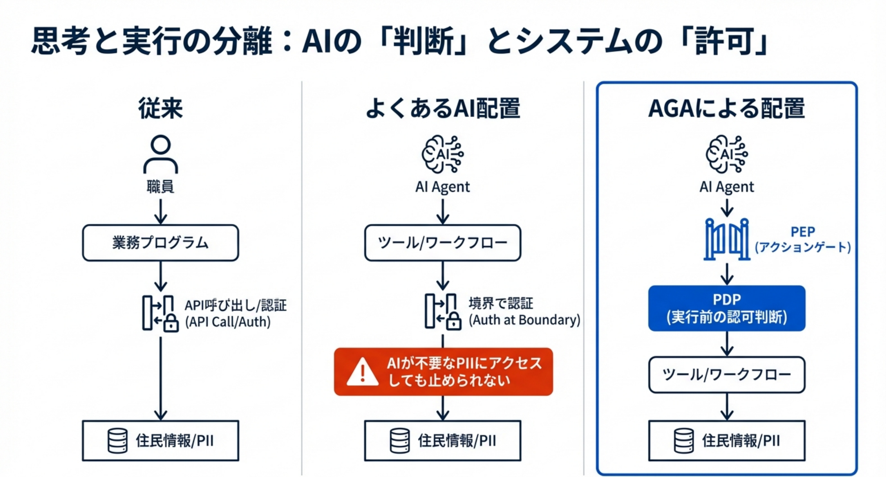
*よくあるAI配置では「AIが不要なPIIにアクセスしても止められない」問題が発生*

---

# 「賢いAI」以上に「破綻しない業務構造」が重要

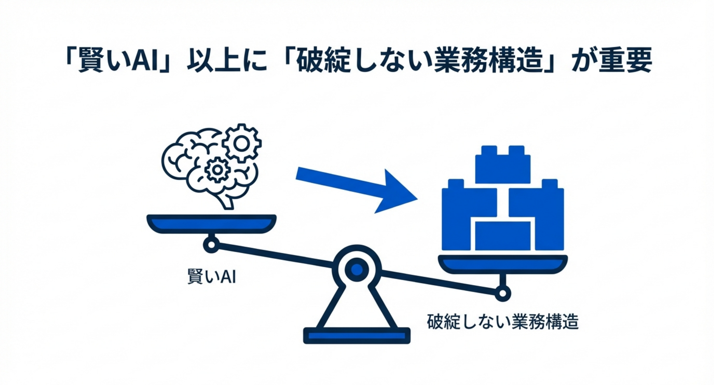
*AIの賢さよりも、構造としての堅牢性を優先すべき*

---

# Call to Action for Your Role

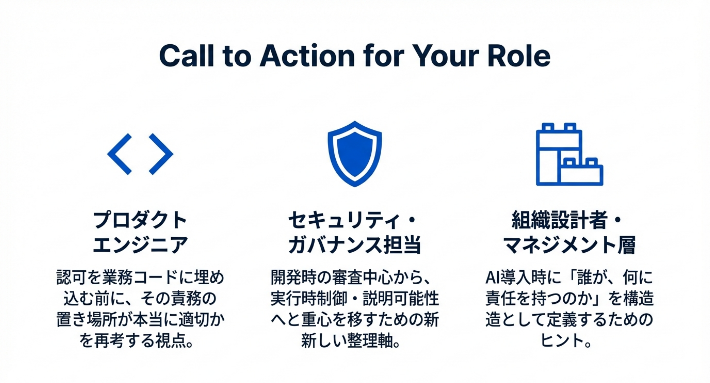
*プロダクトエンジニア・セキュリティ担当・組織設計者それぞれの視点*

---

# 参考：PDP/PEPアーキテクチャ全体図

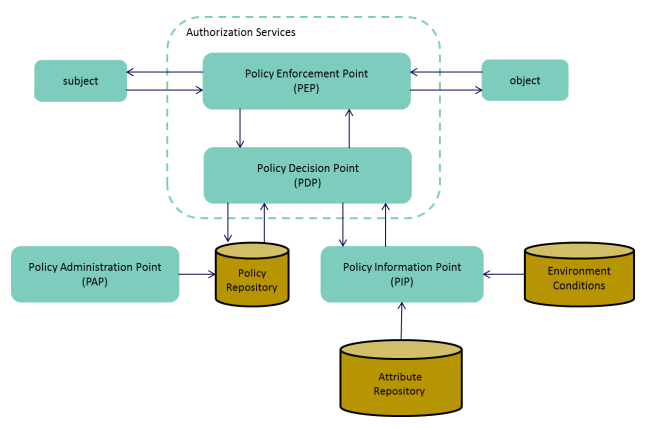
*認可サービスの標準的なアーキテクチャ（PAP, PIP, Attribute Repository含む）*

---

<!-- 従来の配置 -->

  <h3 class="text-center text-sm font-bold">従来の配置</h3>

  
人間が操作し、境界で権限を確認する

職員 / 業務担当者

  
↓

  
① 権限の確認

  
業務プログラム

  
(システム全体へ繋ぐ)

  
↓

  
② api呼び出し / 認証

住民情報 / PII

<!-- よくある AI Agent の配置 -->

  <h3 class="text-center font-bold" style="font-size: 22px;">よくある AI Agent の配置</h3>

  
AI が行動を生成するが、認可は境界のまま

  
AI Agent

  
(行動を自律的に生成)

  
↓

  
① 行動を選択

ツール / ワークフロー

  
↓

  
② 境界で認証

住民情報 / PII

⚠️ AI が不要な PII にアクセスしても止められない

<!-- AGA による配置 -->

  <h3 class="text-center text-sm font-bold">AGA による配置</h3>

  
行動ごとに認可ゲートを通過させる

  
AI Agent

  
(行動を自律的に生成)

  
↓

  
① Actionごと

  
PEP

  
(アクションゲート)

  
↓

  
② ポリシー評価

  
PDP

  
(実行前の認可判断)

  
↓

  
③ ツール実行

ツール / ワークフロー

  
↓

  
④ データアクセス

住民情報 / PII

ポイント: ビジネスフローと認可判断が分離されており、実行前にアクションゲート(PEP)を必ず通る

