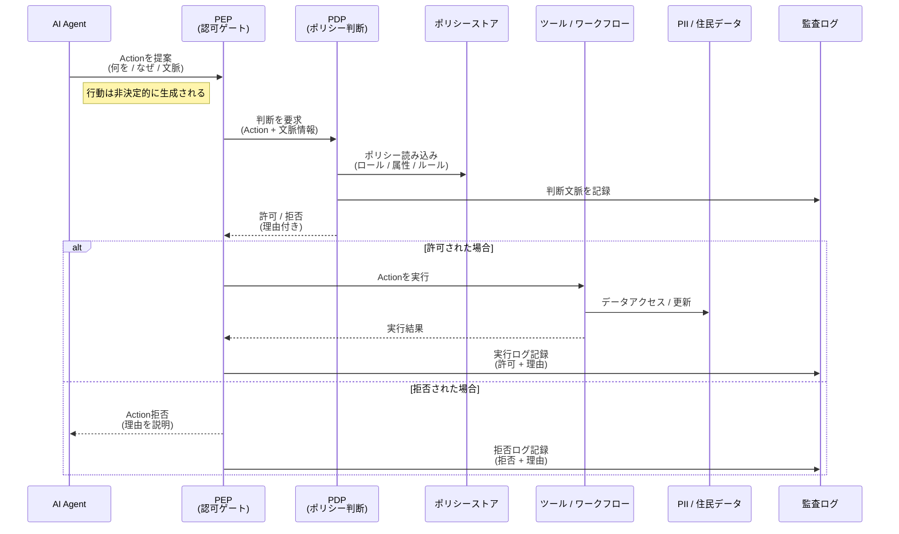

## TL;DR
- AI Agent 時代、認可を業務フローに埋め込む設計は破綻し始めている
- 問題は RBAC / ABAC / ReBAC などの認可の仕組みではなく「認可の配置」にある
- 本記事では、認可を業務から切り離し、PDP/PEPを実行前に配置する構造として **Action-Gated Authorization（AGA）** を提案する

---

AI Agent が業務システムに入り始めたことで、
これまで暗黙のうちに成立していた「認可の置き場所」に関する前提が、静かに崩れつつあります。

従来の認可設計は、「業務フローが決まっている」ことを前提としてきました。
人が操作し、画面を遷移し、API を呼び出す。
その一連の流れが事前に定義できる世界では、認可は画面や API の境界に置けば十分だったからです。

しかし AI Agent は、この前提を根本から変えます。
Agent は業務フローをなぞる存在ではなく、次の行動を自ら生成する存在です。

ここで、素朴ですが避けられない疑問が出てきます。

**認可は、いったいどこに置くべきなのでしょうか。**

---

## 💥 崩壊：業務フロー前提の認可が通用しなくなる
> この章では、「なぜ従来の認可設計が AI Agent で破綻するのか」を自治体業務を例に説明します。

### 背景：自治体業務における PII と説明責任
この問題が特に深刻に現れるのが、自治体業務です。

自治体が扱う **PII**（Personally Identifiable Information）は、
単なる「個人情報」ではありません。

- 住民票・戸籍・税・福祉・医療など、生活や権利に直結する情報
- 一度扱いを誤ると、取り消しや回復が困難な情報
- 住民から「なぜその情報に触れたのか」を必ず問われる対象

**そのため自治体では、「アクセスできたか」よりも「なぜその時点で、その情報に触れる必要があったのかを説明できるか」が常に問われます。**

### Before：人間中心・業務フロー前提の認可
従来の認可は、人間中心・業務フロー前提で成立していました。

- 操作主体：人間
- 実行経路：事前定義された業務フロー
- 認可の位置：画面・API 境界

この構造では、「この画面にアクセスできる職員」「この API を呼び出せるロール」といった境界型の認可が、安全装置として機能していました。

### After：AI Agent により実行経路が非決定的になる
**AI Agent** は、実行経路そのものを動的に生成します。

- 目的に応じて行動を生成する
- 複数のツールや API を選択する
- 実行時に判断や計画を変更する

**このとき、従来の API 境界での認可は、Agent が選択した行動の妥当性までを保証できなくなります。**

| 観点 | Before：人間中心・業務フロー前提 | After：AI Agent により実行経路が非決定的 |
|---|---|---|
| 主な操作主体 | 人間 | AI Agent |
| 業務の進み方 | 事前に定義された業務フローをなぞる | 実行時に行動を生成・選択する |
| 実行経路 | 固定・予測可能 | 動的・非決定的 |
| 認可の置き場所 | 画面・API 境界 | 画面・API 境界のまま（従来設計） |
| 認可が見ているもの | 「誰が／どの画面・APIにアクセスしたか」 | 同左（行動の目的や妥当性は見ない） |
| 業務目的との対応 | 人間が暗黙に担保 | Agent の内部判断に依存 |
| PII へのアクセス | 業務フローに沿って限定される | 必要以上のアクセスが発生しうる |
| 認証・権限の正当性 | 問題になりにくい | 正しくても業務的に不適切な行動が起きうる |
| 説明責任の所在 | 人間・組織に帰属 | AI の判断に押し込まれやすい |
| 自治体業務との相性 | 成立していた | **説明責任の前提が崩れる** |

### 正しく認証された AI が、業務的に不適切な行動を取る
ここで問題になるのは、不正アクセスや攻撃ではありません。

- 認証・認可は正しい
- 権限設定も正しい
- システム上は「可能」

それでも、業務として正当化できない行動が発生しうるのです。

例：問い合わせ対応Agentの不適切な行動

住民から「ゴミ収集日を教えてください」という問い合わせに対し、AIが自動で以下を実行:

1. ✅ 住所から収集区域を検索（OK）
2. ✅ 収集日カレンダーを取得（OK）
3. ❌ 住民の世帯情報・納税情報まで取得（NG）

システム上は「認証済み」「権限あり」だが、この問い合わせ目的には不要な **PII** アクセスが発生しています。

さらに、これが営業時間外（深夜22時）に実行された場合、
「なぜその時間帯に、その情報へのアクセスが必要だったのか」という説明責任を果たせません。

**なぜなら自治体業務では、「その目的のために、その時点で、その情報が本当に必要だったか」を説明できないアクセスは、たとえ正規権限であっても許容されないためです。**

### 自治体でこの問題が深刻化する理由
問題は、説明責任を構造的に果たせなくなる点にあります。
自治体では「説明できない自動処理」が監査・住民説明の観点で重大な問題になりやすいためです。

**で、ここが一番まずいポイントです。説明責任の最終地点を、AI の中に置いてしまっています。**

住民や監査から問われるのは、次の問いです。

> なぜ、その AI は、その時点で、その個人情報にアクセスする必要があったのか。

これに対して、

- 「AI が自動で判断しました」
- 「システム上は可能でした」

という説明は、自治体では通用しません。
少なくとも、自治体業務の文脈では、この説明は通らないはずです。

**求められるのは、事後説明ではなく、事前に防ぐ設計です。**

### AI Agent 時代の認可に、まだ答えはない
#### 自治体が抱える構造的課題
この問題は、理論や技術の話にとどまりません。
地方自治体の文脈では、AI を導入した瞬間に次のようなペインが顕在化します。

- 誰が判断主体だったのかを説明できない
- なぜその情報にアクセスしたのかを後から証明できない
- そして結局、自動化された処理に対して、住民・監査へ責任を返せなくなる

実際、[デジタル庁](https://www.digital.go.jp/policies/local-government-dx)や[総務省](https://www.soumu.go.jp/main_sosiki/joho_tsusin/digital_local_government/)の公開資料でも、自治体業務においては自動化よりも説明責任・統制の重要性が繰り返し強調されています [1][2]。

**これは「AI を使えるかどうか」ではなく、「責任を持って運用できる構造になっているか」が問われていることを意味します。**

### 関連研究・既存アプローチから見える潮流
LayerX Tech Blog の **「[認可はなぜ難しいのか](https://tech.layerx.co.jp/entry/2022/11/08/101238)」** では、業務フローと認可が密結合してきた歴史的背景と、その限界が整理されています [3]。
これは、認可が難しいのではなく、業務ロジックの内側に埋め込んできた設計判断そのものが、変更耐性を失わせているという指摘です。

👉 **だから何か？**

**認可が難しいのではなく、「業務フローに埋め込んでしまう置き方」こそが難しさを増幅させているということです。**

また、同じくLayerX Tech Blog の **「[IdP で中央集権的な認可の管理を実現できる(かもしれない) ID-JAG の紹介](https://tech.layerx.co.jp/entry/2025/11/13/233943)」** は、**OAuth 2.0** の拡張仕様（IETFで議論中）を題材に、ユーザー同意（consent）を都度アプリが取りに行くのではなく、**IdP** 側に移譲できる可能性を紹介しています [4]。

👉 **だから何か？**

**AI Agent が業務を"代行"し始めると、「毎回ユーザーに同意を取りに行く」前提が崩れます。そのとき認可の制御点がアプリ境界だけでは足りず、IdP 側へ寄せる（中央集権化する）発想が現実味を帯びます。**
※ただし [4] が主に扱っているのは「認可の主体・配置（中央集権化）」であり、「実行時の文脈判断（ポリシー評価）」を直接主張しているわけではありません。

さらに、QueryPie の **「[Welcome to the Age of AgentSecOps](https://www.querypie.com/ja/features/documentation/white-paper/21/welcome-to-the-age-of-agentsecops)」** では、**AI Agent** が自律的に行動する時代において、実行中心（execution-centric）なセキュリティ、すなわち実行時のポリシー評価やガードが必要になると整理されています [5]。

👉 **だから何か？**

**セキュリティの議論ですら、「開発時・事前審査中心」から「実行時に評価して止める」へ重心が移っています。**

ここで重要なのが時間軸です。

- 2023年は"Agentは研究・実験"が中心でした
- 2024年にツール連携が普及し
- 2025年に入ってから実業務に入れる文脈（**AI Agent** を前提にした認可議論）が表に出始めました

**つまり今は、「業務が先に動き始めたのに、認可の配置原理が追いついていない」タイミングです。**

一方で、認可をどこに置くべきか、業務ロジックとどう切り離すべきかという配置の問題については、まだ明確な合意は存在していません。

**本記事では、このギャップを埋めるため、認可の再配置という考え方を提案します。**

## 🔄 提案：認可の再配置による業務フローとの分離
> ここからは、前章の問題を解くために「認可の置き場所」をどう変えるべきかを整理します。

### 問題は認可モデルではなく「認可の配置」にある
**RBAC** や **ABAC**、**ReBAC** が悪いわけではありません。
ここで少し立ち止まりたいのは、

**そもそも認可を業務フローの中に埋め込んできたこと自体は、本当に正しかったのか？**

という点です。

これまでの認可設計は、

- 業務フローが事前に定義できる
- 実行経路が固定されている
- 認可判断のタイミングが明確である

という前提のもとで成立してきました。

**しかし AI Agent によって業務の実行経路が非決定的になると、「どのモデルを使うか」以前に、「認可をどこで、どの責務として行うか」が根本的に問い直されます。**

### 認可に求められる要件を整理する
ここまでの議論から、**AI Agent** 時代の業務認可には、
少なくとも次の要件が求められていることが分かります。

1. 実行前に止められること
 - 事後ログや事後説明ではなく、問題のある行動は「実行される前」に防げる必要があります

2. 業務文脈を含めて判断できること
 - 単に「誰が呼んだか」ではなく、何の目的で／いつ／どの状況で行われる行動なのかを判断材料に含める必要があります

3. 業務ロジックから独立していること
 - if 文や例外処理として業務コードに埋め込まれるのではなく、判断の責務が明確に分離されている必要があります

4. 判断理由を後から説明できること
 - なぜ許可したのか／なぜ拒否したのかが、属人性ではなく構造として残る必要があります

**重要なのは、これらは新しい要件ではなく、人間中心の業務では暗黙に満たされてきた要件だという点です。**

**AI Agent によって業務の実行主体が変わったことで、これらの要件を明示的な構造として設計し直す必要が生じました。**

ここで初めて、

> これらの要件を満たすには、どのような構造が必要なのか？

という問いが立ち上がります。

この問いに対する整理として、セキュリティや認可の分野ではすでに判断と実行を分離するという考え方が知られています。
それが **PDP / PEP** という役割分担です。

### 認可の基本構造：PDP / PEP

PDP / PEP は、新しい仕組みや発明ではありません。
むしろその発端は、「**認可の判断と実行が密結合すると、システムが破綻する**」という、かなり古典的な問題意識にあります。

もともと認可は、

- アプリケーションの中で
- if 文や分岐として
- 実装者の判断で

書かれることが多い領域でした。

しかしこのやり方では、

- ルールが増えるほどコードが複雑化する
- 「なぜ許可されたのか」が後から説明できない
- 業務や制度が変わるたびに実装を触る必要がある

といった問題が顕在化します。

この反省から生まれたのが、
**「認可の判断」と「その結果を実行に反映する責務」を分離する** という考え方です。
その役割分担に名前を与えたものが、**PDP / PEP** です。

PDP / PEP は、XACML や NIST SP 800-162 などで整理されてきた、
**アクセス制御分野では標準的な構造**です。

（図の挿入）

※ 本図は **NIST SP 800-162 (Guide to Attribute Based Access Control)** に掲載されている
PDP / PEP / PIP / PAP の標準的な関係を示した図を引用したものです。

**PDP（Policy Decision Point）**

業務文脈をもとに「許可すべきか」を判断する点です。

判断材料には以下のような要素が含まれます：
- 時間帯
- 業務目的
- 状態
- **PII** の有無

PDP は、「その行動が業務として正当化できるか」を
文脈込みで判断する責務を担います。

**PEP（Policy Enforcement Point）**

PDP の判断を **実行直前で強制する点**です。

PEP は、「判断結果を確実に実行へ反映させる」責務を担い、許可されない行動が実行されないことを構造として保証します。

PDP が **考える責務**、PEP が **止める責務**を担うことで、認可判断は業務フローや実装から切り離されます。

### 提案：Action-Gated Authorization（AGA）

AGA（Action-Gated Authorization）は、AI Agent　が生成する**Action（行動）ごとに認可ゲートを設ける**構造です。

以下のシーケンス図は、「Agentが考える」と「実行してよいか」を明確に分離した構造を示しています。

#### AGAの核心：思考と実行の分離

従来の設計では、認可チェックは「API呼び出し時」や「画面遷移時」など、
システムの境界に配置されていました。

しかし AI Agent は、その境界の内側で **複数の行動を動的に生成・選択** します。

**AGA の解決策：**

AI Agent が「行動を生成」する一方で、
その行動の **実行可否は必ず認可構造（PDP / PEP）を通過** させます。

つまり：
- **行動判断**：AI Agent（思考の自由）
- **実行許可**：組織の認可構造（PDP / PEP）（実行の統制）

PDP / PEP を業務フローの外に配置することで、
Agent が生成した行動であっても、
組織のポリシーに反する実行は **事前に防止** できます。

## ⚖️ 評価：提案内容の整理
> この章では、AGA が「何を変え」「何を変えないのか」を責任・技術・運用の観点で整理します。

### この提案が変えるもの
#### 1) 責任と説明責任の構造

**Before：人間中心の責任構造**
- **行動判断**：人間が判断し、実行します
- **責任の所在**：人・組織に集中します
- **問題点**：AI を導入すると、判断と実行の境界が曖昧になり、責任の所在が不透明になります

**After：責務分離による説明可能な構造**
- **行動判断**：AI Agent（自由に思考・計画）
- **実行許可**：認可構造（PDP / PEP）
- **責任の所在**：ポリシーとログによって説明可能です
- **利点**：AI が何を考えても、組織のポリシーによって実行を制御できます

責務境界の比較（Before / After）

| 観点 | Before（人間中心・境界認可） | After（AGA：責務分離） |
|---|---|---|
| 判断（何をするか） | 人間 | Agent |
| 実行（手を動かす） | 人間 | ツール / ワークフロー |
| 実行許可（やってよいか） | アプリ境界の認可（画面/API） | PDP/PEP（Action 実行前のゲート） |
| 統制（ルールの管理） | アプリ内に散在（実装・if・例外） | ポリシー（集中管理） |
| 説明責任（なぜ許可/拒否したか） | 事後に属人的（ログだけでは理由が薄い） | 判断理由＋監査ログとして残る |
| 監査のしやすさ | 「できた/できない」は追えるが、「なぜ」が追いにくい | 「なぜ」を含めて追える（説明が成立しやすい） |

この提案が変えるのは、「誰が考えたか」ではなく、**「何をもって実行を許したかを説明できる構造」** です。

#### 2) 既存の認可基盤との関係

この提案は、新しい認可モデルを発明するものではありません。
変えるのは **モデルそのものではなく、その配置** です。

既存の認可基盤を前提として：
- IAM や RBAC / ABAC / ReBAC を置き換える必要はありません
- PDP / PEP という役割分担の考え方を、業務フローの外に配置します
- すでにある認可の仕組みを、実行時の制御点として再構成します

この設計により、既存の資産（ロール設計・属性設計・監査ログ設計）と衝突することなく、**段階的に導入可能な構造**を実現できます。

### この提案が変えないもの（スコープの明示）

本記事は、次の点を主張しません。

- フル IAM や認証基盤の刷新
- 特定の認可モデルの優劣
- UI や業務フロー設計の正解
- AI Agent による完全自律運用

扱っているのは、**「認可をどこに置くべきか」という一点のみ**です。

### よくある質問への回答

> 「AI に任せるのは危険では？」

ここで言っているのは「AI が判断して良い」ではなく、**AI が実行して良いかどうかは別問題**という整理です。

- 判断（プラン生成）：AI Agent が行います
- 実行許可（最終ゲート）：認可構造（**PDP / PEP**）が行います

**説明責任の最終地点を AI の内部に置かず、組織の制御点として保持します。**

> 「人が止めればよくない？」

人は常時介在できず、また「なぜ止めたか／止めなかったか」が属人的になります。
これは説明責任がスケールしません。

> 「結局ルールを増やすだけでは？」

ルールを増やす話ではなく、**止める場所を明確にする話**です。
認可を業務ロジックから切り離すことで、変更点と責任点を局所化できます。

> 「現場で運用できないのでは？」

業務コードに散らばった if 文や例外処理として認可を抱える方が、長期的には運用できません。
認可を外に出すことで、何を変えればよいかが明確になります。

**この提案の本質は、「AI を賢くする話」ではなく、AI を信用しなくても業務と説明責任が成立する構造を設計することにあります。**
要するに、AGA は AI を信用しない設計の話です。AI が賢くなるのを待たずに、先に業務側の構造を固めます。

## 🎯 おわりに

AI Agent を業務に導入する流れは、もはや止められません。
だからこそ問われるのは、「AI を信用できるかどうか」ではなく、

- **信用しなくても業務が成立する構造を持てているか**
- **説明責任や統制を、設計として引き受けられているか**

という点です。

AI Agent が業務に入り始めたことで、従来の認可設計が **そのままでは成立しない場面が増えてきました**。

この問題に対して本記事が提案したのは、認可の仕組みを刷新することではなく、**認可を業務フローから切り離し、実行直前に必ず通過させる構造へ再配置すること**でした。

この考え方を、本記事では
**Action-Gated Authorization（AGA）** と呼びました。

最後に、この話がどのような立場の人に関係するのかを整理します。

- **プロダクトエンジニア**
認可を業務コードやワークフローに埋め込む前に、
その責務の置き場所が本当に適切かを立ち止まって考えるための視点。

- **セキュリティ・ガバナンス担当**
開発時・事前審査中心から、
実行時制御・説明可能性へと重心が移る中での、新しい整理軸。

- **組織設計者・マネジメント層**
AI 導入時に曖昧になりがちな
「誰が、どこで、何に責任を持つのか」を構造として定義するためのヒント。

AI Agent 時代において重要なのは、
「賢い AI を作ること」以上に、
**賢く振る舞えなかった場合でも破綻しない業務構造を持つこと**です。

認可の再配置は、そのための地味ですが避けて通れない前提条件です。

## 📚 参考記事・関連資料

[1] **[地方公共団体におけるDX推進（デジタル庁）](https://www.digital.go.jp/policies/local-government-dx)**
- 自治体業務におけるデジタル化の前提条件として、説明責任・統制・責任分界を明示

[2] **[自治体情報システムの標準化・ガバナンス（総務省）](https://www.soumu.go.jp/main_sosiki/joho_tsusin/digital_local_government/)**
- 住民情報・業務システムにおける厳格な統制と責任所在の必要性を整理

[3] **[認可はなぜ難しいのか](https://tech.layerx.co.jp/entry/2022/11/08/101238)**
- 業務フローと認可が密結合してきた歴史的背景と、その限界を整理

[4] **[IdP で中央集権的な認可の管理を実現できる(かもしれない) ID-JAG の紹介](https://tech.layerx.co.jp/entry/2025/11/13/233943)**
- 認可を事前定義ではなく、実行時・文脈依存で制御するという問題意識を提示
- 人間中心の業務においても、従来のロールベース認可が限界に近づいていることを示している

[5] **[Welcome to the Age of AgentSecOps](https://www.querypie.com/ja/features/documentation/white-paper/21/welcome-to-the-age-of-agentsecops)**
- AI Agent が自律的にツール・データへアクセスする時代のセキュリティとガバナンス課題を整理
- 実行時制御・監査可能性・説明責任の重要性を強調

[6] **[Identity Management for Agentic AI](https://www.openid.or.jp/Identity-Management-for-Agentic-AI-jp_v1.1.pdf)**
- Agentic AI における Identity / Authorization の論点整理
- 標準化・将来像の観点からの包括的な整理

[7] **[Authorized AI Agents](https://arxiv.org/abs/2501.09674)**
- AI Agent に権限を与える際の理論的整理とリスク分析

[8] **[個人情報保護委員会：個人情報保護法の概要](https://www.ppc.go.jp/personalinfo/)**
- 正規権限であっても「目的外利用」が許されないことを明示
- 自治体業務における PII 取り扱いの前提資料
